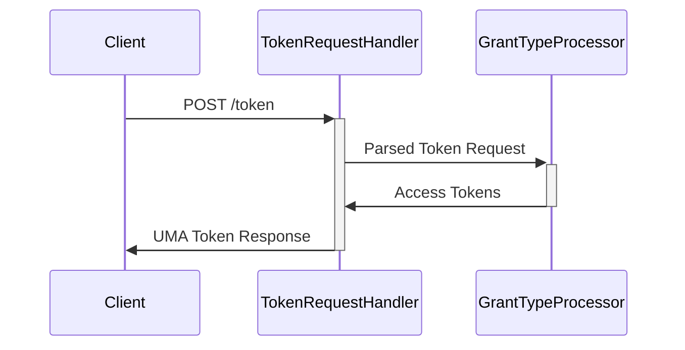

# Architecture

## UMA Service
The UMA service's primary HTTP request handler is tasked with processing [Access Token requests](https://docs.kantarainitiative.org/uma/wg/rec-oauth-uma-grant-2.0.html#seek-authorization) for the UMA Grant Type (`urn:ietf:params:oauth:grant-type:uma-ticket`). The generic TokenRequestHandler can handle any grant type through a configured `GrantTypeProcessor`, for the UMA support this is implemented in the `UmaGrantProcessor`-class.

## Authorization Agent